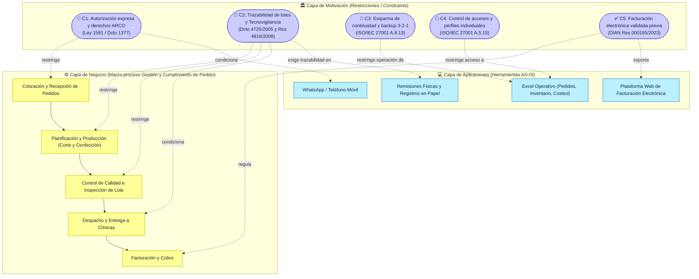

# 📄 Informe Técnico del Taller

## 🔖 Nombre del Taller
Taller 6 - Checklist de Cumplimiento Normativo y Seguridad de la Información

## 👥 Integrantes del equipo
- Jorge Steven Doncel Bejarano — Código: 282296 / Usuario GitHub: [gevengood](https://github.com/gevengood) / Correo: [jorgedobe@unisabana.edu.co](mailto:jorgedobe@unisabana.edu.co)
- David Santiago Buendia Londoño — Código: 306487 / Usuario GitHub: [Santiagoob7](https://github.com/Santiagoob7) / Correo: [davidbulo@unisabana.edu.co](mailto:davidbulo@unisabana.edu.co)

---

## 🧠 Descripción general del trabajo

El objetivo del Taller 6 es verificar los aspectos legales, normativos, de privacidad y de seguridad de la información que impactan la arquitectura empresarial de **Insuclínicos Ltda.**, empresa bogotana dedicada a la confección y comercialización de prendas e insumos médicos desechables en tela quirúrgica.

En la Parte 1 (trabajo en clase), el equipo analizó el caso de referencia estatal **GobData**, evaluando una lista de control de 12 ítems frente a la Ley 1581 de 2012 (Habeas Data) y el estándar internacional ISO/IEC 27001, comprendiendo que el cumplimiento no se limita a marcar casillas afirmativas o negativas, sino que exige contrastar cada control contra **evidencias objetivas y verificables**, transformando cada incumplimiento en una brecha formal con riesgo y prioridad evaluados.

En esta Parte 2, adaptamos dicha metodología de auditoría y diagnóstico legal-tecnológico a la realidad operativa de **Insuclínicos Ltda.** (empresa de 6 trabajadores que gestiona su operación mediante Excel, WhatsApp, llamadas telefónicas, remisiones físicas en papel y una plataforma web externa de facturación electrónica). Además de los marcos generales de protección de datos (Ley 1581 de 2012, Decreto 1377 de 2013) y seguridad de la información (ISO/IEC 27001:2022), incorporamos la normativa sectorial sanitaria colombiana obligatoria para fabricantes de insumos médicos: el **Decreto 4725 de 2005** (régimen de registros sanitarios y vigilancia de dispositivos médicos) y la **Resolución 4816 de 2008** (Programa Nacional de Tecnovigilancia y trazabilidad de lotes del INVIMA / MinSalud), junto con las directrices tributarias de la DIAN para la facturación electrónica (**Resolución 000165 de 2023**).

---

## 🔧 Proceso de desarrollo

El trabajo se estructuró siguiendo estrictamente la metodología oficial de 5 pasos establecida en la guía del curso:

### Paso 1: Identificación de datos y procesos sensibles
Se mapearon los activos de información, procesos, contenedores C4, infraestructura y amenazas STRIDE definidos en los Talleres 0 a 5, identificando su grado de criticidad y el marco legal aplicable:
- **Datos personales de clientes y prospectos:** Nombres de contacto, teléfonos móviles, correos electrónicos y cargos de directores de compras de aproximadamente 40 clínicas, consultorios odontológicos y spas. Regulado por la **Ley 1581 de 2012** y el **Decreto 1377 de 2013**.
- **Datos de empleados y talento humano:** Información de los 6 colaboradores (hojas de vida, cédulas, números de cuenta de nómina, afiliaciones a seguridad social y registros de salud ocupacional). Calificados como datos personales y sensibles bajo la **Ley 1581 de 2012**.
- **Trazabilidad de lotes y materias primas (Rollos de tela quirúrgica no tejida / SMS):** Datos de origen, número de lote del proveedor, fechas de corte, órdenes de producción y remisiones de despacho a instituciones de salud. Regulado por el **Decreto 4725 de 2005** y la **Resolución 4816 de 2008 (Tecnovigilancia INVIMA)**.
- **Información financiera y comercial:** Listas de precios pactadas, volúmenes de pedido, cotizaciones, costos de producción y registros contables en Excel. Regulado por el **Código de Comercio**, **Estatuto Tributario** y la norma **ISO/IEC 27001**.
- **Facturación electrónica y soportes fiscales:** Facturas emitidas, números de autorización de la DIAN, CUFE y archivos XML/PDF firmados digitalmente. Regulado por la **Resolución DIAN 000165 de 2023**.

### Paso 2: Construcción del checklist contextualizado
Se consolidó una matriz de 15 criterios de cumplimiento distribuidos en 8 categorías:
1. *Consentimiento* (2 ítems - Autorización informada y revocatoria/derechos ARCO).
2. *Seguridad de la Información / ISO 27001* (4 ítems - Política de seguridad, control de accesos, cifrado y continuidad/backups).
3. *Protección de Datos Personales* (2 ítems - Designación de DPO y registros de auditoría/logs).
4. *Prevención de Fugas de Información / DLP* (1 ítem - Bloqueo de puertos y control de exportaciones).
5. *Retención y Disposición Documental* (2 ítems - Retención legal y destrucción segura/anonimización).
6. *Roles, Responsabilidades y Capacitación* (2 ítems - Acuerdos de confidencialidad y sensibilización del personal).
7. *Regulación Sanitaria Sectorial - INVIMA* (1 ítem - Trazabilidad de insumos médicos y tecnovigilancia).
8. *Regulación Tributaria - DIAN* (1 ítem - Emisión y conservación de facturación electrónica).

### Paso 3: Evaluación del cumplimiento (Cumple / Parcial con evidencia)
De acuerdo con las reglas metodológicas del curso, cada ítem se evaluó bajo solo dos estados posibles: **✅ Cumple** o **⚠️ Parcial**, sustentado con evidencias fácticas recopiladas del levantamiento con el cliente (Santiago Martínez, Representante Legal):
- **✅ Cumple (2 ítems):** Retención documental legal contable (ítem 10) y emisión reglamentaria de facturas electrónicas vía plataforma autorizada (ítem 15).
- **⚠️ Parcial (13 ítems):** Controles que actualmente no existen o están implementados de manera empírica, informal o incompleta en la operación cotidiana de la empresa.

### Paso 4: Documentación y análisis de riesgos de las brechas
Cada uno de los 13 ítems marcados como **⚠️ Parcial** fue trasladado a la hoja `Brechas Identificadas` del archivo [`checklist-cliente.xlsx`](checklist-cliente.xlsx), analizando el impacto ante su no corrección en términos legales (investigaciones o sanciones de la Superintendencia de Industria y Comercio - SIC o requerimientos del INVIMA), operativos (pérdida irrecuperable de datos por fallo físico de disco o secuestro mediante ransomware) y comerciales (fuga de bases de datos de clientes y fórmulas de patronaje).

### Paso 5: Priorización y formulación de recomendaciones accionables
Se asignó el nivel de prioridad (**Alta**, **Media**, **Baja**) a cada brecha considerando la gravedad del riesgo, la probabilidad de materialización y la viabilidad económica/operativa para una microempresa de 6 trabajadores, garantizando que cada recomendación proporcione una solución concreta y de aplicación progresiva.

---

## 🧩 Análisis del modelo propuesto

### Estructura de la evaluación entregada
El artefacto central de evaluación es el libro de cálculo [`checklist-cliente.xlsx`](checklist-cliente.xlsx), el cual se compone de dos hojas estructuradas:
1. **Hoja 1 (`Checklist General`):** Contiene la evaluación de los 15 criterios, señalando categoría, criterio auditado, nivel de cumplimiento obtenido, evidencia objetiva levantada en el negocio y la recomendación inicial.
2. **Hoja 2 (`Brechas Identificadas`):** Contiene la matriz de riesgos derivada exclusivamente de las 13 deficiencias encontradas, detallando la categoría, la formulación concisa de la brecha, la severidad del riesgo (Alto, Medio o Bajo), la recomendación prioritaria y el nivel de prioridad asignado (Alta, Media o Baja).

A continuación se resume la matriz de brechas priorizadas para Insuclínicos Ltda.:

| Categoría | Brecha Identificada | Riesgo | Recomendación Prioritaria | Prioridad |
|---|---|:---:|---|:---:|
| **Seguridad** | Carencia de un plan formal de continuidad (BCP/DRP) y copias de seguridad automatizadas. | **Alto** | Implementar copias de seguridad automatizadas en almacenamiento en nube cifrado bajo esquema 3-2-1 y realizar simulacro semestral de restauración. | **Alta** |
| **Seguridad** | Falta de autenticación individual por perfiles de usuario en equipos compartidos de oficina. | **Alto** | Crear cuentas individuales en Windows con contraseñas seguras y permisos diferenciados por rol. | **Alta** |
| **Regulación Sanitaria** | Riesgo de trazabilidad incompleta entre lote de tela quirúrgica y pedidos despachados ante alertas sanitarias (INVIMA). | **Alto** | Estandarizar el registro del número de lote de materia prima en la orden de producción y remisión de entrega para cumplir con Tecnovigilancia. | **Alta** |
| **Consentimiento** | Ausencia de autorización previa y expresa de tratamiento de datos en pedidos y cotizaciones (Ley 1581). | **Alto** | Incorporar plantilla de autorización de datos personales en cotizaciones, mensajes iniciales de WhatsApp y correos electrónicos. | **Alta** |
| **Seguridad** | Ausencia de cifrado de archivos en reposo para libros de Excel con datos comerciales y de clientes. | **Medio** | Habilitar contraseña de cifrado robusto nativo de Microsoft Excel en archivos de clientes y pedidos. | **Media** |
| **Prevención de Fugas** | Ausencia de controles DLP y libre extracción de información operativa y comercial vía USB o reenvío. | **Medio** | Deshabilitar puertos USB no autorizados y definir política de uso de dispositivos y prohibición de envío de datos a cuentas personales. | **Media** |
| **Protección de Datos** | Inexistencia de registros de auditoría (logs) sobre modificaciones y consultas a la base de clientes y pedidos. | **Medio** | Integrar en el diseño de la arquitectura TO-BE un registro transaccional automatizado de modificaciones de estados y datos. | **Media** |
| **Consentimiento** | Inexistencia de un canal formal y procedimiento documentado para el ejercicio de derechos ARCO. | **Medio** | Habilitar buzón formal de peticiones ARCO y definir protocolo operativo de respuesta en menos de 15 días hábiles. | **Media** |
| **Protección de Datos** | No designación formal de Oficial o Responsable de Protección de Datos en la estructura de la empresa. | **Medio** | Formalizar el rol de responsable de protección de datos en cabeza del administrador con funciones y responsabilidades claras. | **Media** |
| **Roles y Responsabilidades** | Contratos de trabajo sin cláusulas de confidencialidad, no divulgación y protección de datos. | **Medio** | Firmar otrosí de confidencialidad y custodia de información comercial/industrial con los 6 empleados de la planta. | **Media** |
| **Retención** | Ausencia de protocolo formal de destrucción segura de remisiones físicas obsoletas y borrado de archivos temporales. | **Bajo** | Adquirir destructora de papel básica para la oficina y programar limpieza segura periódica de archivos temporales. | **Baja** |
| **Seguridad** | Inexistencia de política formal escrita de seguridad de la información aprobada por gerencia. | **Bajo** | Redactar documento conciso de Política de Seguridad de la Información acorde a las dimensiones de Insuclínicos Ltda. | **Baja** |
| **Roles y Responsabilidades** | Falta de capacitación y sensibilización al personal en ciberseguridad y protección de datos personales. | **Bajo** | Realizar taller anual interactivo sobre detección de phishing, ingeniería social en WhatsApp y manejo de datos. | **Baja** |

### Cómo representa las necesidades del cliente
El diagnóstico no es una copia teórica o genérica; captura las tensiones reales observadas en los talleres previos:
- **Sobrecarga de herramientas informales:** Al depender de WhatsApp para negociar y cerrar pedidos, la empresa expone involuntariamente números celulares y nombres de contactos sin ningún respaldo jurídico bajo la Ley 1581.
- **Riesgo crítico de pérdida de datos operativos:** El núcleo de la empresa descansa en libros de Excel locales. La ausencia de un esquema de backup formalizado (identificada como Brecha de Prioridad Alta) significa que una falla de hardware en la única oficina paralizaría de inmediato los despachos, cobros y compras de tela quirúrgica.
- **Exigencias sanitarias del sector salud:** Como fabricante de prendas médicas desechables destinadas a ambientes quirúrgicos y odontológicos, la trazabilidad del lote no es una recomendación opcional, sino una obligación del INVIMA. Una queja por desprendimiento de fibras o defecto de barrera microbiológica requiere aislar inmediatamente a qué clientes se despachó el lote afectado.
- **Restricciones presupuestales:** Las recomendaciones evitan sugerir plataformas corporativas de costos prohibitivos (como ERPs enterprise o suites DLP de alto costo); en su lugar, plantean medidas de costo casi nulo o muy bajo: habilitación de perfiles nativos de Windows, cifrado con contraseña propio de Excel, anexos contractuales en papel, almacenamiento en nube empresarial básica con sincronización automática y estandarización de números de lote en las remisiones de entrega.

### Supuestos tomados
- Se asume que Insuclínicos Ltda., al ser una persona jurídica constituida como sociedad de responsabilidad limitada que trata datos de clientes y empleados, está sujeta al régimen de la Ley 1581 de 2012, pero por su tamaño de activos no está obligada a inscribir sus bases de datos en el RNBD de la SIC (privilegio de micro y pequeñas empresas según Decreto 090 de 2018), aunque sí debe cumplir con todos los principios sustantivos de autorización, seguridad y derechos ARCO.
- Se asume que la plataforma de facturación electrónica utilizada cuenta con la debida certificación técnica y firma digital validada ante la DIAN, por lo que el proceso de emisión cumple los estándares vigentes.
- Se asume que las prendas médicas elaboradas (batas quirúrgicas, campos, polainas, gorros y sábanas desechables) corresponden a dispositivos médicos Clase I (riesgo bajo o no invasivo), sujetos a notificación sanitaria o registro simplificado y al programa de Tecnovigilancia del INVIMA.

---

## 📈 Diagrama final entregado: Vista ArchiMate de Motivación

Tal como establece la sección 6 de la guía del taller, cada brecha del checklist se modela conceptualmente en la capa de **Motivación** de ArchiMate como una **Restricción (`Constraint`)** impuesta por la ley o las normas técnicas, la cual condiciona y restringe a los procesos de negocio y a los componentes de aplicación de Insuclínicos Ltda. En futuros ciclos de arquitectura (como la fase de Brechas y Hoja de Ruta TO-BE), estas restricciones generarán los Gaps a cerrar:

---

## 📋 Tabla de actores, entidades o componentes

La siguiente tabla describe los actores organizacionales, los activos tecnológicos y los componentes regulatorios involucrados en el cumplimiento normativo de Insuclínicos Ltda.:

| Nombre del elemento | Tipo | Descripción | Responsable |
|---|---|---|---|
| **Representante Legal (Santiago Martínez)** | Actor / Rol | Responsable de la dirección estratégica, firma de contratos comerciales y asunción legal del rol de Responsable del Tratamiento de Datos (DPO). | Gerencia / Representante Legal |
| **Administración / Ventas** | Actor / Rol | Gestiona cotizaciones, captura datos de clientes, coordina compras y emite facturas electrónicas. | Auxiliar Administrativo / Comercial |
| **Producción y Calidad** | Actor / Rol | Realiza tendido de tela, corte, confección, verificación de especificaciones técnicas y asignación de números de lote. | Jefe de Producción / Operarios |
| **Despacho y Almacén** | Actor / Rol | Custodia materias primas y producto terminado, emite remisiones de entrega físicas y entrega pedidos a transportadoras o clientes. | Encargado de Almacén |
| **Clientes Corporativos** | Actor Externo | Aproximadamente 40 clínicas, centros estéticos, spas y consultorios que compran insumos y cuyos datos de contacto se custodian. | Titulares de Datos |
| **INVIMA / MinSalud** | Ente Regulador | Autoridad sanitaria encargada de vigilar la inocuidad, registros sanitarios y tecnovigilancia de dispositivos médicos en Colombia. | Entidad de Control |
| **SIC (Delegatura de Datos)** | Ente Regulador | Autoridad de protección de datos en Colombia, facultada para investigar y sancionar infracciones a la Ley 1581. | Entidad de Control |
| **DIAN** | Ente Regulador | Autoridad fiscal que exige la emisión, validación y conservación de facturas y soportes electrónicos. | Entidad de Control |
| **Excel Operativo** | Componente de Aplicación | Hojas de cálculo locales que centralizan pedidos, clientes, inventario y costos; principal activo de información vulnerable. | Administración |
| **WhatsApp / Correo** | Componente de Aplicación | Canales de mensajería y correo electrónico utilizados para recibir solicitudes y transmitir datos personales sin cifrado de capa superior. | Ventas / Administración |
| **Remisiones Físicas** | Componente Físico | Documentos manuales en papel donde se registran entregas a clientes; soporte físico de trazabilidad e información comercial. | Almacén / Despacho |

---

## 🔍 Investigación complementaria

### Tema 1: Marco Regulatorio Sanitario del INVIMA y Tecnovigilancia para Insumos Médicos Desechables (Decreto 4725 de 2005 y Resolución 4816 de 2008)

#### Resumen
En Colombia, las prendas quirúrgicas descartables elaboradas en tela no tejida (polipropileno tipo SMS, spunbond o meltblown), tales como batas para cirujano, batas para paciente, campos fenestrados, gorros, polainas y mascarillas, están catalogadas legalmente como **dispositivos médicos** para uso en salud humana. De acuerdo con el **Decreto 4725 de 2005**, estos elementos se clasifican principalmente como **Clase I (bajo riesgo)**, dado que son dispositivos no invasivos o de contacto transitorio que actúan como barreras biológicas para el control de infecciones nosocomiales. Esta categorización implica que el fabricante no solo debe contar con concepto técnico favorable de condiciones sanitarias expedido por el INVIMA (o cumplir el Manual de Condiciones Sanitarias y Buenas Prácticas de Manufactura), sino que está sometido obligatoriamente al **Programa Nacional de Tecnovigilancia** reglamentado mediante la **Resolución 4816 de 2008**.

La Tecnovigilancia exige implementar un sistema riguroso de trazabilidad bidireccional que permita identificar y rastrear cualquier evento o incidente adverso asociado al uso del producto médico. Para Insuclínicos Ltda., esto significa que si un hospital reporta un incidente (por ejemplo, una rasgadura del material durante un procedimiento quirúrgico o un lote contaminado), la empresa debe tener la capacidad técnica de: (1) identificar el rollo de tela quirúrgica específico y proveedor del lote de materia prima; (2) aislar todos los pedidos confeccionados con dicho lote; y (3) ubicar exactamente a qué clientes y en qué fechas fue entregado el producto defectuoso para activar un retiro preventivo de mercado (*recall*). La situación actual de Insuclínicos, donde la producción y los despachos se gestionan en hojas de cálculo fragmentadas y remisiones manuales en papel, expone a la empresa a sanciones graves por parte del INVIMA, que van desde el decomiso de mercancías y suspensión de actividades hasta multas de hasta 10.000 salarios mínimos legales diarios vigentes.

---

### Tema 2: Aplicación Pragmática del Principio de Responsabilidad Demostrada (*Accountability*) de la Ley 1581 de 2012 en Microempresas

#### Resumen
La **Ley 1581 de 2012** y el **Decreto 1377 de 2013** establecen que cualquier organización que recolecte, almacene o use datos personales es catalogada como Responsable del Tratamiento. Aunque el Decreto 090 de 2018 exoneró a las micro y pequeñas empresas de inscribir formalmente sus bases de datos en el Registro Nacional de Bases de Datos (RNBD) de la Superintendencia de Industria y Comercio (SIC), dicha excepción es de carácter puramente registral: **no exime en absoluto a las PyMEs del cumplimiento sustantivo de la ley**. Insuclínicos Ltda. está plenamente obligada a obtener la autorización previa, expresa e informada del titular, a conservar prueba de dicha autorización y a responder oportunamente las consultas y reclamos de los derechos ARCO.

La Guía para la Implementación del Principio de Responsabilidad Demostrada expedida por la SIC resalta que las medidas de cumplimiento deben ser proporcionales a la estructura y capacidad del responsable. Para una microempresa manufacturera de 6 empleados, la SIC no exige contratar un equipo de auditoría externa ni adquirir software de gobernanza de datos de alto costo. En su lugar, el estándar de debida diligencia se satisface con:
1. Redacción de una Política de Tratamiento de Información (PTI) breve y comprensible.
2. Inclusión de una leyenda de autorización breve en los formatos comerciales existentes (cotizaciones en PDF, mensajes predeterminados de bienvenida en WhatsApp Business y firmas de correo).
3. Designación expresa de una persona de contacto interno (el Representante Legal o Administrador) como encargado de atender solicitudes ARCO en un plazo legal máximo de 15 días hábiles.
4. Suscripción de acuerdos de confidencialidad con los colaboradores que manipulan bases de clientes y proveedores. Adoptar estas medidas sencillas blinda legalmente a Insuclínicos frente a quejas ante la SIC que podrían acarrear multas pecuniarias sucesivas.

---

### Tema 3: Enfoque Gradual de Seguridad de la Información (ISO/IEC 27001:2022) en Entornos PYME con Ofimática Descentralizada

#### Resumen
El estándar internacional **ISO/IEC 27001:2022** en su Anexo A consolida 93 controles de seguridad organizados en cuatro temas: organizacionales, de personas, físicos y tecnológicos. En organizaciones con un perfil tecnológico emergente como Insuclínicos Ltda., donde no existe un departamento de TI ni infraestructura de servidores locales, intentar certificar o desplegar el estándar completo de forma abrupta resulta inviable y paralizaría la operación. No obstante, las mejores prácticas de ciberseguridad para PyMEs (tales como las guías del NIST Cybersecurity Framework y el CIS Controls Group 1) recomiendan priorizar los controles de **higiene digital básica**:

1. **Gestión de Identidades y Control de Accesos (Controles A.5.15 y A.8.5):** Eliminar el uso de perfiles genéricos en los computadores compartidos de la oficina mediante la creación de cuentas de usuario individuales en Windows, acompañadas de contraseñas de al menos 12 caracteres y bloqueo automático de pantalla por inactividad.
2. **Respaldo y Continuidad (Control A.8.13):** Reemplazar las copias de seguridad esporádicas en memorias USB por un esquema automatizado siguiendo la regla **3-2-1**: tres copias de los datos operativos (la copia activa de trabajo en el PC, una copia de sincronización local automática en un disco externo y una copia cifrada fuera de sede en almacenamiento cloud como OneDrive o Google Workspace corporativo), realizando al menos dos pruebas anuales de restauración.
3. **Protección Criptográfica en Reposo (Control A.8.24):** Utilizar la función nativa de cifrado de archivos de Microsoft Excel (mediante contraseña con algoritmo robusto AES-128/256) para proteger los libros que contienen información de pedidos, clientes y costeo, mitigando el impacto ante la pérdida o sustracción física de un equipo.

---

## 📚 Referencias

- [1] Congreso de la República de Colombia. (2012). *Ley Estatutaria 1581 de 2012: Por la cual se dictan disposiciones generales para la protección de datos personales*. Diario Oficial No. 48.587.
- [2] Presidencia de la República de Colombia. (2013). *Decreto 1377 de 2013: Por el cual se reglamenta parcialmente la Ley 1581 de 2012*.
- [3] Presidencia de la República de Colombia. (2018). *Decreto 090 de 2018: Por el cual se modifican los plazos para la inscripción de bases de datos en el RNBD*.
- [4] Superintendencia de Industria y Comercio - SIC. (2015). *Guía para la implementación del Principio de Responsabilidad Demostrada (Accountability)*. Bogotá D.C., Colombia.
- [5] Ministerio de la Protección Social & INVIMA. (2005). *Decreto 4725 de 2005: Por el cual se reglamenta el régimen de registros sanitarios, permiso de comercialización y vigilancia sanitaria de los dispositivos médicos para uso humano*.
- [6] Ministerio de la Protección Social & INVIMA. (2008). *Resolución 4816 de 2008: Por la cual se reglamenta el Programa Nacional de Tecnovigilancia*.
- [7] Dirección de Impuestos y Aduanas Nacionales - DIAN. (2023). *Resolución 000165 de 2023: Por la cual se desarrolla el sistema de facturación electrónica y se adopta el anexo técnico*.
- [8] International Organization for Standardization - ISO. (2022). *ISO/IEC 27001:2022: Information security, cybersecurity and privacy protection — Information security management systems — Requirements*. ISO, Ginebra.
- [9] Center for Internet Security - CIS. (2021). *CIS Critical Security Controls Version 8 — Implementation Group 1 (IG1)*. CIS Security.
- [10] Universidad de La Sabana. (2026). *Guía Paso a Paso: Checklist de Cumplimiento Normativo*. Material docente del curso Arquitectura Empresarial (AREM).
- [11] Insuclínicos Ltda. (2026). *Ficha de Caracterización, Documento de Visión, Modelos C4, Mapa de Infraestructura y Evaluación STRIDE (Entrevista con Santiago Martínez, Representante Legal)*. Talleres 0 a 5 del curso AREM.

---

_Este documento hace parte de la entrega del Taller 6 del curso AREM (Arquitectura Empresarial) — Universidad de La Sabana._
